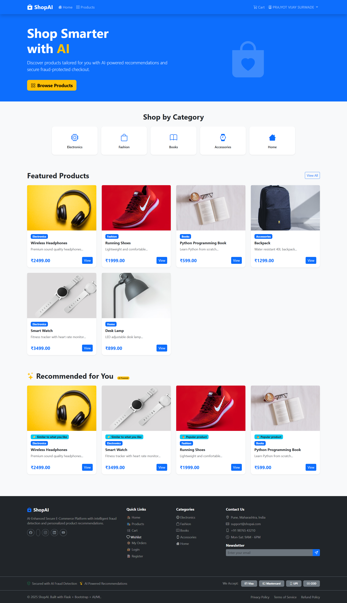
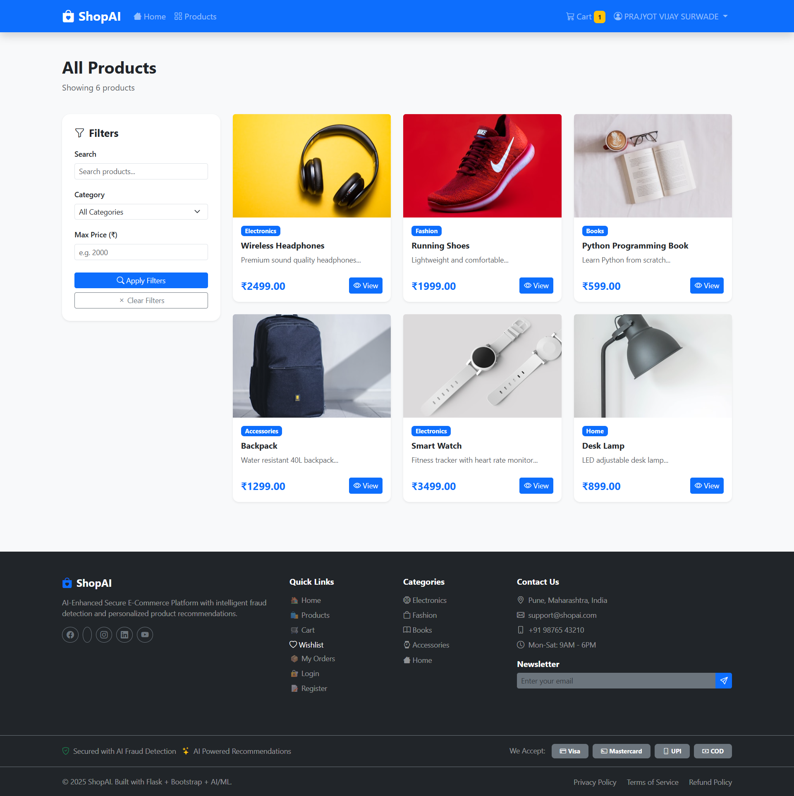
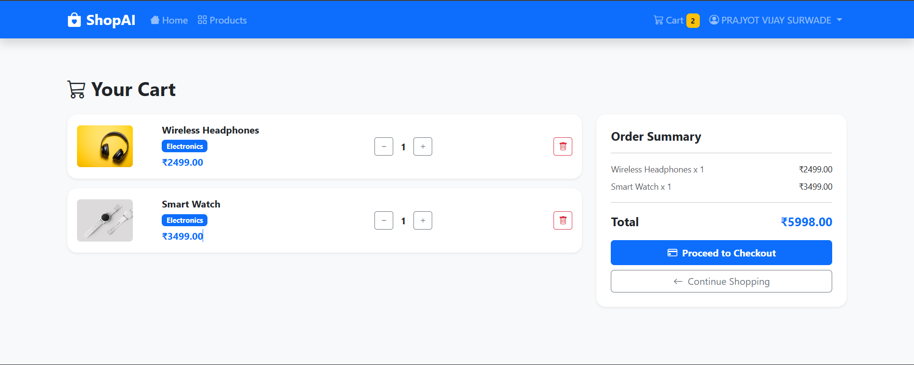
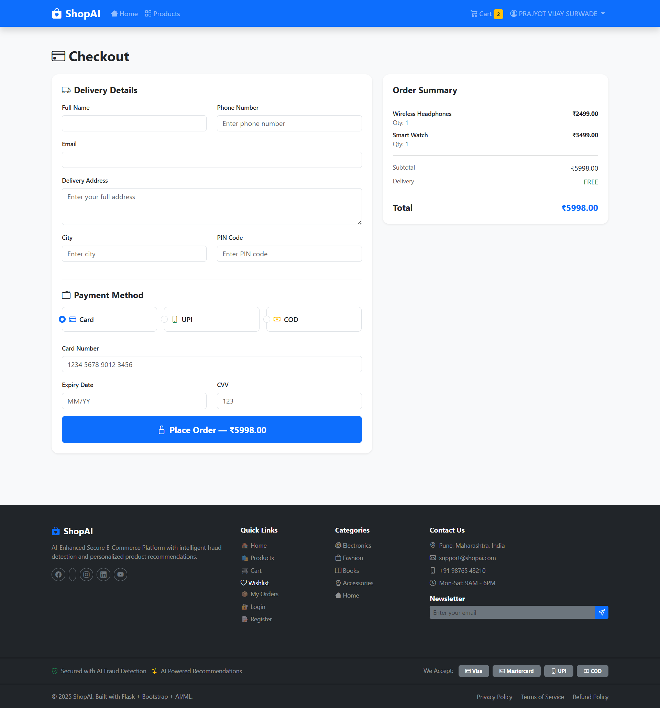
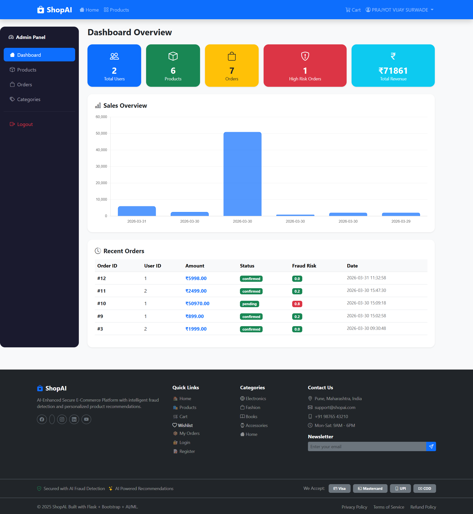
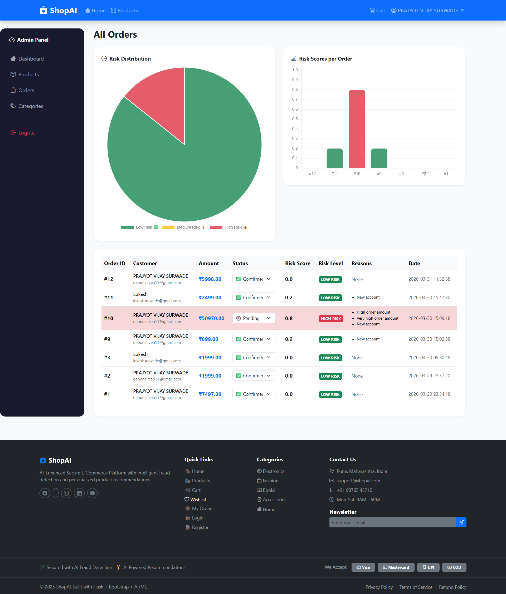

# 🛍️ ShopAI - AI-Enhanced Secure E-Commerce Platform


A full-stack e-commerce web application with AI-powered product recommendations and intelligent fraud risk detection system.

---

## 🚀 Features

### 👤 Customer Features
- User Registration & Login with secure password hashing
- Browse, search and filter products by category and price
- AI-powered personalized product recommendations
- Add to cart with quantity management
- Wishlist to save favourite products
- Product ratings and reviews
- Secure checkout with dummy payment system
- Order history tracking

### 🔧 Admin Features
- Dashboard with sales overview and charts
- Total users, products, orders and revenue stats
- Add, edit and delete products
- Dynamic category management
- View all orders with status update
- AI Fraud Risk Detection with visualization
- Fraud risk alerts for high risk orders

### 🤖 AI Features
- **Collaborative Filtering** — Recommends products based on similar users behaviour
- **Content Based Filtering** — Recommends products from same category
- **Fraud Detection** — Analyses order patterns and flags suspicious orders
- **Risk Scoring** — Assigns fraud risk score with reasons

---

## 🛠️ Tech Stack

| Layer | Technology |
|---|---|
| Frontend | HTML, CSS, Bootstrap 5, JavaScript |
| Backend | Python, Flask |
| Database | MySQL |
| AI/ML | Scikit-learn, Pandas, NumPy |
| Icons | Bootstrap Icons |
| Charts | Chart.js |

---

## 📁 Project Structure
```
Ecommerce/
├── app.py                  # Main Flask application
├── config.py               # Configuration settings
├── requirements.txt        # Python dependencies
├── routes/
│   ├── auth.py             # Login, Register, Logout
│   ├── products.py         # Product listing and detail
│   ├── cart.py             # Cart management
│   ├── orders.py           # Checkout and orders
│   ├── admin.py            # Admin dashboard
│   └── wishlist.py         # Wishlist management
├── ai/
│   ├── recommender.py      # AI recommendation system
│   └── fraud_detector.py   # Fraud risk detection
├── templates/
│   ├── base.html           # Base layout
│   ├── index.html          # Home page
│   ├── cart.html           # Cart page
│   ├── checkout.html       # Checkout page
│   ├── wishlist.html       # Wishlist page
│   ├── orders.html         # My orders page
│   ├── order_success.html  # Order success page
│   ├── 404.html            # Custom 404 page
│   ├── auth/               # Login and Register pages
│   ├── products/           # Product listing and detail
│   └── admin/              # Admin dashboard pages
└── static/
    ├── css/style.css       # Custom styles
    └── js/main.js          # Custom JavaScript
```

---

## ⚙️ Installation & Setup

### Prerequisites
- Python 3.13+
- MySQL 8.0+
- Git

### 1. Clone the repository
```bash
git clone https://github.com/PrajyotVijay/shopai.git
cd shopai
```

### 2. Create virtual environment
```bash
python -m venv venv --without-pip
venv\Scripts\activate
python -m ensurepip --upgrade
```

### 3. Install dependencies
```bash
python -m pip install -r requirements.txt
```

### 4. Setup MySQL Database
```bash
mysql -u root -p
```
```sql
CREATE DATABASE ecommerce_db;
USE ecommerce_db;
-- Run the SQL schema from database/schema.sql
```

### 5. Configure the app
Edit `config.py`:
```python
MYSQL_PASSWORD = 'your_mysql_password'
SECRET_KEY = 'your_secret_key'
```

### 6. Run the app
```bash
python app.py
```

Visit `http://127.0.0.1:5000` 🎉

---

## 🤖 AI System Details

### Recommendation System
```
1. Collaborative Filtering (Scikit-learn Cosine Similarity)
   → Finds similar users and recommends what they bought

2. Content Based Filtering
   → Recommends products from same category

3. Fallback
   → Shows popular products if no history available
```

### Fraud Detection System
```
Risk Factors:
- High order amount (> ₹10,000) → +0.2
- Very high order amount (> ₹50,000) → +0.4
- New account (< 1 day old) → +0.2
- Multiple orders in 1 hour → +0.3
- Large first order (> ₹5,000) → +0.2

Risk Levels:
- 0.0 - 0.3 → LOW RISK ✅
- 0.3 - 0.6 → MEDIUM RISK ⚡
- 0.6+ → HIGH RISK ⚠️
```

---

## 📸 Screenshots

### 🏠 Home Page


### 🛍️ Products Page


### 📦 Product Detail


### 🛒 Cart Page


### 💳 Checkout Page


### 🔧 Admin Dashboard


### 📊 Admin Orders & Fraud Detection


---

## 👨‍💻 Developer

**Prajyot Vijay Surwade**
- BE Information Technology — Savitribai Phule Pune University
- BS Data Science & AI/ML — IIT Madras
- LinkedIn: [My LinkedIn](https://www.linkedin.com/in/prajyot-surwade-80b1933b2)
- GitHub: [My GitHub](https://github.com/PrajyotVijay)

---

## 📄 License

This project is for educational and portfolio purposes.